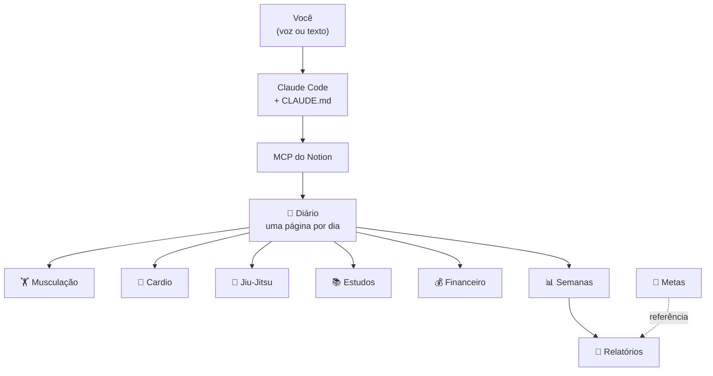

# 🧭 Sistema de Evolução Pessoal

Um assistente operacional que registra treino, estudo, água, peso e dinheiro em **9 bancos de dados do Notion** — a partir de frases soltas em português.

```
> feito treino, bebi 1L, gastei 42,90 de gasolina no pix

✅ Treino marcado · 💧 Água 2,0/3,5 L · 💸 R$ 42,90 Combustível/Pessoal/Pix · Score 45% → 55%
```

Sem formulário, sem clique, sem abrir o Notion. Você fala, ele registra, marca os checkboxes certos, recalcula o score e devolve **uma linha** de confirmação.

---

## O que é

Não é um app. É um [Claude Code](https://claude.com/claude-code) configurado com o MCP do Notion e um `CLAUDE.md` que define regras rígidas de operação: fuso horário local, nunca duplicar o dia, água é acumulativa, registrar sessão marca o checkbox correspondente, nunca inventar número.

O trabalho pesado está em três lugares:

| Arquivo | Papel |
|---|---|
| [`CLAUDE.md`](CLAUDE.md) | As regras de ouro, o mapa dos bancos e o dicionário de linguagem natural |
| [`notion-ids.json`](notion-ids.json) | Cache de IDs — o agente nunca precisa procurar os bancos de novo |
| [`.claude/commands/`](.claude/commands) | 13 slash commands, um por operação |

---

## Arquitetura



O `📅 Diário` é o centro. Toda sessão registrada nos bancos filhos se relaciona de volta ao dia e marca o checkbox correspondente. `📊 Semanas` agrega os dias por rollup; `📝 Relatórios` guarda o histórico narrado.

### Os 9 bancos

| Banco | Papel |
|---|---|
| 📅 **Diário** | Uma página por dia. 11 checkboxes de hábito + água, peso, sono, energia, score |
| 🏋️ **Musculação** | Sessões de academia. Divisão, duração, RPE, volume, tabela de exercícios no corpo da página |
| 🏃 **Cardio** | Corrida, bike, esteira, HIIT. Pace calculado automaticamente |
| 🥋 **Jiu-Jitsu** | Rounds, finalizações, posições treinadas, o que corrigir |
| 📚 **Estudos** | Trilhas Java/Spring, ADS, Inglês, IBGE, Leitura, Negócios |
| 💰 **Financeiro** | Entradas e saídas em três centros de custo: Pessoal, Cantina, Nexar |
| 📊 **Semanas** | Agregados semanais ISO (segunda→domingo) com rollups sobre os dias |
| 🎯 **Metas** | Alvos por área e horizonte, com progresso |
| 📝 **Relatórios** | Diários, semanais e mensais, com o texto completo no corpo |

---

## Comandos

### O trio do dia a dia

```bash
/feito treino, água 500ml, inglês
```
```bash
/status
```
```bash
/relatorio
```

`/feito` engole linguagem solta e marca os checkboxes certos. `/status` diz o que falta em até 8 linhas. `/relatorio` fecha o dia, calcula o score e grava.

### Todos os 13

| Comando | O que faz |
|---|---|
| `/dia` | Garante a página de hoje e mostra feito × falta |
| `/feito` | Marca uma ou mais atividades — `/feito treino, água 500ml, inglês` |
| `/agua` | Soma litros ao dia — `/agua 500ml` → +0,5 (acumulativo) |
| `/treino` | Registra musculação com exercícios e cargas, marca `Treino` |
| `/cardio` | Registra cardio, calcula o pace, marca `Cardio` |
| `/jj` | Registra jiu-jitsu, marca `Jiu-Jitsu` |
| `/estudo` | Registra estudo e infere a trilha → marca `Dev`, `Estudo IBGE`, `Inglês` ou `Livro` |
| `/gasto` | Lança saída — `/gasto 42,90 gasolina pix` infere categoria, centro e método |
| `/entrada` | Lança entrada (Cantina, Nexar, outros) |
| `/relatorio` | Relatório do dia: score, faltas, água, dinheiro, streaks |
| `/semana` | Fecha a semana ISO, compara com a anterior, sempre com delta |
| `/mes` | Fechamento mensal por categoria e por centro + evolução física |
| `/status` | Ultracurto: só o que falta hoje |

Datas retroativas funcionam em todos: `/feito ontem: cardio`, `/gasto dia 8 · 62 de combustível`.

### O Score

11 itens, divisor fixo. `Cardio` e `ABS` contam como **um slot** (se alternam entre os dias):

`Treino` · `Cardio`**ou**`ABS` · `Jiu-Jitsu` · `Bíblia` · `Dev` · `Estudo IBGE` · `Inglês` · `Livro` · `Pele` · `Refeições` · `Água ≥ 3,5 L`

---

## Instalação

Passo a passo completo em [`SETUP.md`](SETUP.md). O resumo:

**1.** Conecte o MCP do Notion ao Claude Code:

```bash
claude mcp add --transport http notion https://mcp.notion.com/mcp --scope user
```

**2.** Autentique com `/mcp` dentro do Claude Code e **dê acesso ao workspace inteiro** — sem isso os `create` falham por permissão.

**3.** Dentro da pasta do projeto, cole o conteúdo de [`PROMPT-CLAUDE-CODE.md`](PROMPT-CLAUDE-CODE.md). O build cria a Central de Comando, os 9 bancos, as views, os slash commands e roda um teste de ponta a ponta.

**4.** Uso diário:

```bash
cd ~/sistema-joao && claude
```

> **Voz:** Claude Code é terminal e não escuta áudio. Para falar de verdade, use o app do Claude no celular com o conector do Notion e cole o `CLAUDE.md` nas instruções de um Project. Mesmo sistema, mesma base.

---

## Estrutura

```
sistema-joao/
├── CLAUDE.md               # regras de operação do agente (a alma do projeto)
├── notion-ids.json         # cache de IDs dos 9 bancos e das views
├── LIMITACOES.md           # o que a API do Notion não deixou automatizar
├── PROMPT-CLAUDE-CODE.md   # o prompt de build que cria tudo do zero
├── SETUP.md                # instalação passo a passo
└── .claude/
    └── commands/           # 13 slash commands
        ├── dia.md      feito.md     agua.md      status.md
        ├── treino.md   cardio.md    jj.md        estudo.md
        ├── gasto.md    entrada.md
        └── relatorio.md  semana.md  mes.md
```

---

## Limitações conhecidas

Detalhe completo em [`LIMITACOES.md`](LIMITACOES.md). As três que importam:

1. **Filtros de data relativa não funcionam via API.** Pedir `Data is today` grava a string literal `"today"` e a view volta vazia. As views `Hoje`, `Semana (Board)` e `Este mês` precisam do filtro ajustado na interface do Notion (30 segundos). Não afeta a operação — o agente sempre consulta por SQL com a data calculada.

2. **Não é possível apagar página via MCP.** Não existe ferramenta de exclusão; `in_trash: true` no `update_page` é aceito sem erro e não faz nada. Quando você pedir para apagar um lançamento, o agente zera o valor, limpa as relations e renomeia para `🗑️ ... — PODE APAGAR` — e avisa que você precisa deletar na UI.

3. **Nenhuma fórmula nativa foi criada.** `Score (%)`, `Pace (min/km)`, `Progresso (%)` e os campos `R$` de Semanas são `number` e o agente escreve o valor nos relatórios.

Os 7 rollups de `📊 Semanas` **funcionam** na interface, mas não são legíveis por SQL — os relatórios recalculam a partir das linhas do Diário.

---

## ⚠️ Antes de publicar

`notion-ids.json` contém os IDs reais do workspace, dos bancos e das páginas. Não são credenciais e não dão acesso a nada sozinhos, mas identificam o workspace. Se o repositório for **público**, considere:

```gitignore
notion-ids.json
```

O `PROMPT-CLAUDE-CODE.md` regenera tudo do zero em outro workspace, então o cache de IDs não precisa ir junto.

---

## Stack

[Claude Code](https://claude.com/claude-code) · [Notion MCP](https://mcp.notion.com) · Markdown

Fuso fixo em **America/Maceio (UTC-3)** — "hoje" é sempre a data local, nunca UTC.
